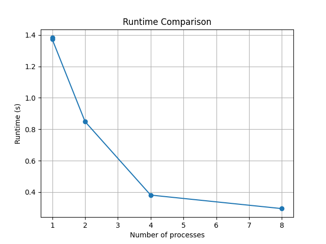
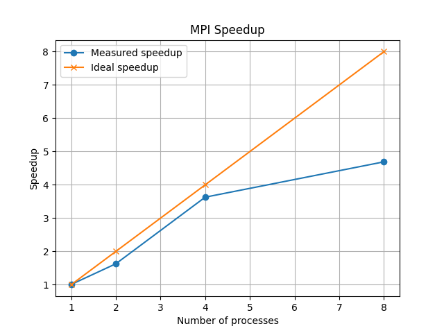
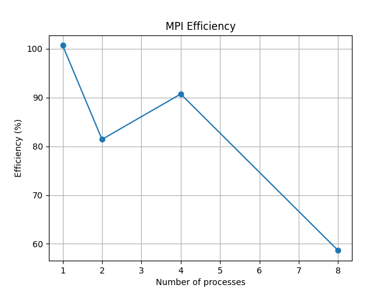

## Benchmark Results

The benchmark was executed using 100,000,000 random points.

| Version | Processes | Runtime (s) | Speedup | Efficiency |
| ------- | --------- | ----------- | ------- | ---------- |
| Serial  | 1         | 1.382       | 1.00    | 1.00       |
| MPI     | 1         | 1.373       | 1.01    | 1.01       |
| MPI     | 2         | 0.849       | 1.63    | 0.81       |
| MPI     | 4         | 0.381       | 3.63    | 0.91       |
| MPI     | 8         | 0.295       | 4.69    | 0.59       |

### Key Observations

* The MPI implementation achieves approximately **4.69× speedup** with 8 processes.
* The best efficiency was observed with **4 processes (90.7%)**.
* Runtime decreases significantly as additional processes participate in the computation.
* Communication overhead becomes more noticeable at higher process counts.
* The Monte Carlo method scales well because the workload is largely independent and requires very little communication between processes.

---

## Performance Plots

After running the analysis script, the following plots are generated.

### Runtime

The runtime decreases significantly as more MPI processes participate in the computation. The MPI implementation reduces the execution time from approximately 1.38 seconds in the serial version to 0.29 seconds when using 8 processes.

### Speedup

The speedup increases as additional MPI processes are used. The measured speedup reaches approximately 4.69× when using 8 processes. While this does not achieve ideal linear scaling, it demonstrates that the Monte Carlo workload benefits substantially from parallel execution.

### Efficiency

Efficiency remains relatively high up to 4 processes, reaching roughly 90.7%. As the number of processes increases, efficiency decreases due to communication overhead and synchronization costs. This behavior is common in parallel applications and illustrates the trade-off between increased parallelism and coordination overhead.

> Note: The efficiency for a single MPI process may slightly exceed 100% because of measurement noise and runtime variability between benchmark executions.

---

